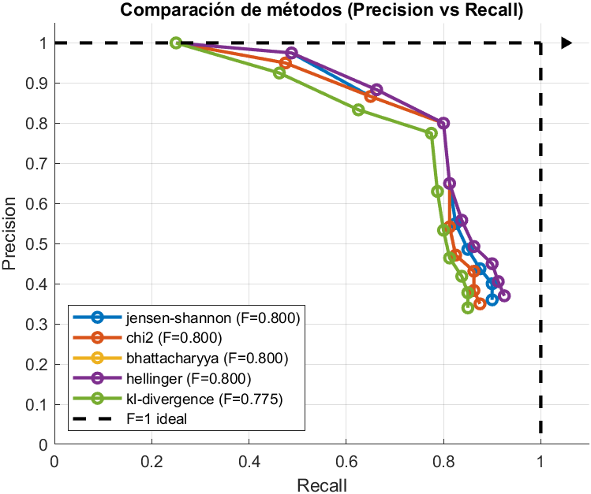

# Similar-Images-Searcher
This was the final project for the subject digital image and video processing. Based on a 2000 image database (UKentuckyDatabase) I created and algorithm where you give it an image and it gives you an array of the most similar ones. In the database there are 4 "similar images" per image(including the original). So the F score is calculated that way


# Sistema de Cerca d’Imatges Similars

**Author:** Guillem Moreno  
**Date:** May 2025  

## 🧠 Project Overview

This project implements a content-based image retrieval (CBIR) system that compares image similarity using color-based descriptors. It builds upon a grayscale-based system (`sistema1`) and introduces a color descriptor using HMMD (Hue, Max-Min, and Diff).

## 📌 System Description

The system (`sistema2`) consists of the following main stages:

### 1. RGB → HMMD Conversion
- Input: RGB image of shape M × N × 3
- Output: HMMD color space using `rgb2hmmd(I)`

### 2. HMMD Quantization
- Supported bins: 32, 64, 128, 256
- Uses predefined tables for hue and sum bins

### 3. Descriptor Construction
- Normalized histogram vector (unit sum)

### 4. Indexing and Storage
- Matrix `H_db` stores all descriptors: `Ndb × numCells`

### 5. Retrieval and Similarity
- Distance metrics used:
  - Chi-squared
  - Bhattacharyya
  - Jensen-Shannon
  - Hellinger
  - KL-divergence

## 📊 Results

### Precision-Recall Curves

Each method was evaluated with different bin counts. Sample visualizations:

| Bins | Precision-Recall Curve |
|------|------------------------|
| 256  |  |
| 128  |  |
| 64   |  |
| 32   |  |

### Performance Summary

#### F1-Scores and Search Time

| Bins | Method           | Time (s) | F1-Score |
|------|------------------|----------|----------|
| 256  | Chi2             | 1.14     | 0.787    |
|      | Bhattacharyya    | 1.39     | 0.838    |
|      | Jensen-Shannon   | 1.61     | 0.838    |
|      | Hellinger        | 1.17     | 0.838    |
|      | KL-divergence    | 1.16     | 0.775    |
| 128  | All top methods  | ~1.2     | 0.800    |
| 64   | Hellinger        | 0.84     | 0.812    |
| 32   | Hellinger        | 0.78     | 0.775    |

## ✅ Best Configuration

- **Hellinger with 64 bins**: Best tradeoff between quality (F1=0.812) and speed (<1s per query)

## 🧪 Implementation Notes

### MATLAB Code Files:
- `Main.m` — system orchestration
- `algo1_indexar.m` — descriptor construction
- `algo2_similitud.m` — similarity calculation
- `algo3_busqueda.m` — query execution
- `precision_recall.m` — evaluation script
- `rgb2hmmd.m` — RGB to HMMD conversion
- `quantizeHMMD.m` — quantization logic

### System Requirements
- MATLAB
- Image database: UKBench (`ukbench%05d.jpg`)
- Input: `input.txt` file with query image names

## 🚀 Running the System

```matlab
% Example parameters
ImDB_path = 'path/to/UKentuckyDatabase/';
hist_bins = 256;
metodos_similitud = {'chi2', 'jensen-shannon', 'bhattacharyya', 'hellinger', 'kl-divergence'};

% Run main script
Main.m
